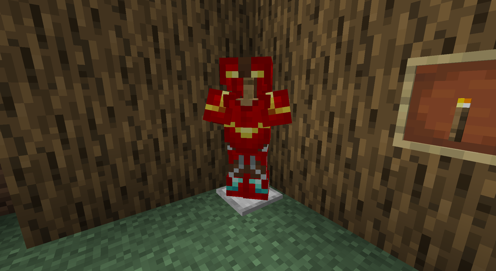
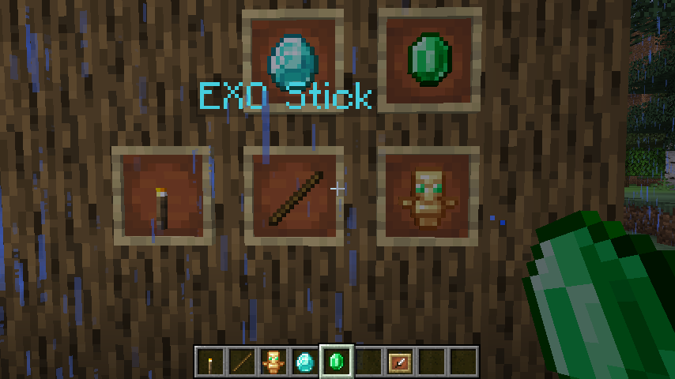
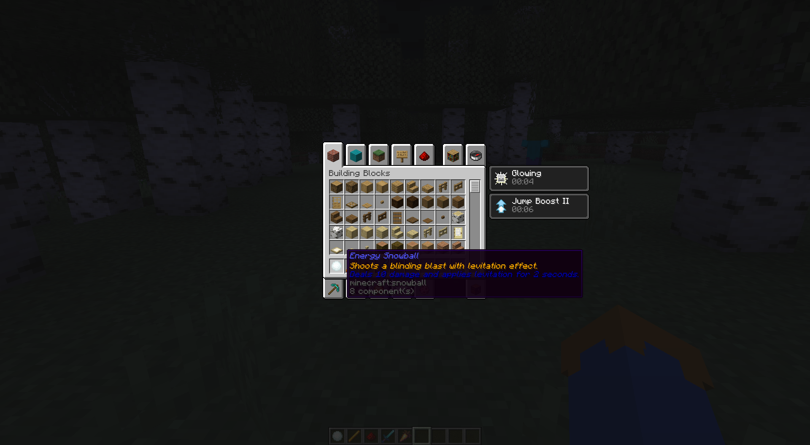
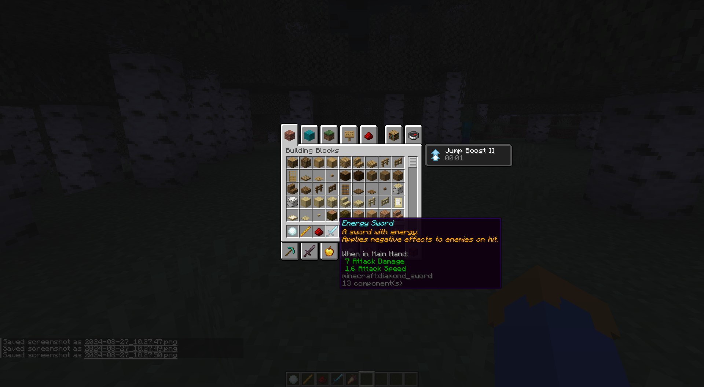

# Suits Minecraft Plugin
## Description

## Suits
### IronMan Suit

#### Helmet
Abilities:
- Night Vision
- Player Hologram - Useful Information for the wearing Player about the other Player like Hearth, Armor, etc.  
Recipes:  
ADDPicture
#### Chestplate
Abilities:
- Absorption  
Recipes:  
ADDPicture
#### Leggings
Abilities:
- Speed  
Recipes:  
ADDPicture
#### Boots
Abilities:
- Jump Boost
- Fly  
Recipes:  
ADDPicture
#### All Parts wearing
- Fire Resistance
- Resistance
- Haste
- Strength
- Saturation
- Water Breathing

## Items:
- ARK Reaktor
- Jarvis
- EXO
- JetEngineCore
- JetEngine
- RepulsoCore
- LaserCore
- Tarnstone
- TimeAccelerator
- Firestck
- LightStick
 

## Weapons:
### RepulsoTool
Makes 15 damage and has a 7-second cooldown.  
### LaserTool
Makes 10 damage and has a 3-second cooldown.  
### EnergySnowball
Makes 5 damage and gives the shoot player levitation  
### SuperCarrot
Gives Regeneration, Resistance and Strength for 10, 60 and 10 seconds.  
But let also the player glow for 25 seconds.  
### EnergySword
Has Sharpness 3 and Knockback 2.  
When hittinf a player, the player gets for 5 seconds WEAKNESS, SLOWNESS and POISON  

## Commands
``/get <player> <item>`` - Get Custom Items from the Plugin

## Preview Pictures -> More in the pictures Folder

